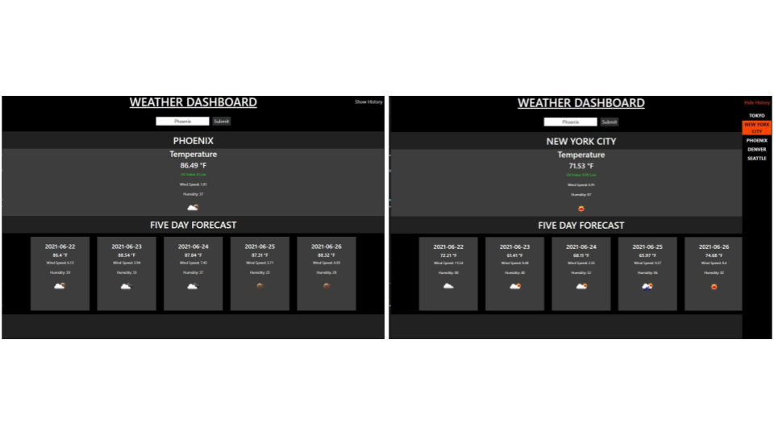

# 20210611 - Weather-Dash-ZK 


 ## Table of Contents.
 * [Overview](#overview)
 * [Design](#overview)
 * [Criteria](#given-criteria)
 * [Questions](#have-questions)
 * [Links](#links)
 ---


## Overview 
Tasked to create a webpage that allows the User to search for a city and see the current and future weather of the city.

## Design


UI was kept simple, and displays the requested elements.

---
## Given Criteria
* The weather dashboard uses form inputs
* When a user searches for a city they are presented with current and future conditions for that city 
* The searched city is added to a search history
* Webpage displays searched city name, the date, an icon representation of weather conditions, the temperature, the humidity, UV index and the wind speed 
* UV Index changes color that indicates whether the conditions are favorable, moderate, or severe
* 5-day forecast displays the date, an icon representation of weather conditions, the temperature, the wind speed, and the humidity
* Search history show current and future conditions for city when clicked


---
## Have Questions
### You can contact me at:

    GITHUB: <https://github.com/ZacharyWK>

    EMAIL: <ZachKrause@live.com>


---
## Links
[REPOSITORY](https://github.com/ZacharyWK/Weather-Dash-ZK)
```
https://github.com/ZacharyWK/Weather-Dash-ZK
```

[DEPLOYED](https://github.com/ZacharyWK/Weather-Dash-ZK)
```
https://github.com/ZacharyWK/Weather-Dash-ZK
```
